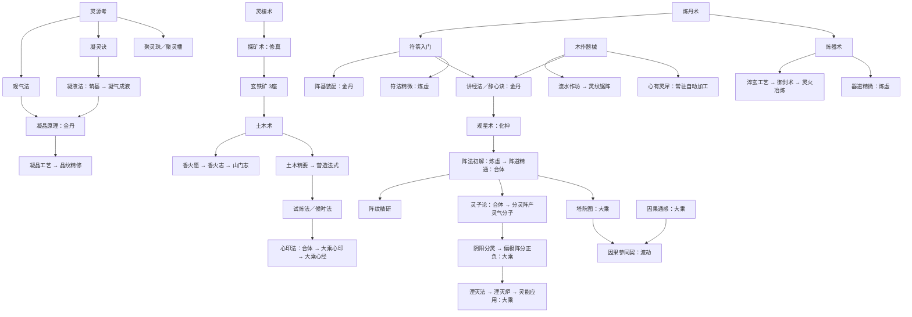

# 当前修真与工艺体系审视（2026-10-09）

以当前工作区 v0.16 数据和引擎为准，反映 2026-10-09 的两线重组（方案与决策见 [RESEARCH.md](RESEARCH.md)）、灵能设定校准（[SPIRIT-ENERGY.md](SPIRIT-ENERGY.md)）以及技艺和法宝扩充。旧五段分类的历史结构见 [BALANCE.md](BALANCE.md)。本轮评估及验证结果见 [BUNDLE-REVIEW.md](BUNDLE-REVIEW.md)。

## 1. 体系分工

| 层 | 当前规模 | 负责什么 | 成长方式 |
| --- | --- | --- | --- |
| 修真（两线＋经营组） | 55 项 | 主线「灵气研究」按境界分章开放建筑、系统；辅线「材料研究」按族承接来源、配方与专业增益；宗门经营收制度节点 | 一次性参悟，主要花感悟，也消耗材料 |
| 技艺 | 22 项 | 通用产量、岗位、仓储、感悟、士气、防灾等增益 | 一次性学习，花感悟与材料 |
| 法宝 | 24 件 | 可祭炼的专门效果 | 初次炼成后可以反复祭炼 |
| 制作 | 15 个配方 | 原料变加工品，多条产业汇合成高级成品 | 手动瞬时制作；自动按配方节拍连续加工 |
| 境界 | 11 境（含凡体） | 全局产出倍率、研究门槛、自动加工速度与重置入口 | 支付下一境的资源费用，确定性突破 |

合计 101 项修真、技艺与法宝。两页共用感悟、前置判断和已学记录；`needs.upgrades` 可以跨页引用。配方开放与专业制作增益已随材料族迁入修真页；引气诀、伐木要术、叠匣术、口传心授、护山阵纹等为通用增益。灵能枢须持续消耗灵能，其实际效果受供能比例限制。

主循环不变：原料生产 → 研究／学习 → 加工 → 建设与扩仓 → 更多产能／感悟 → 破境 → 新研究。境界本身只检查资源费用，不要求完成某个指定研究；研究和建筑在生产、配方与容量上间接支撑破境。

## 2. 两线结构：主线分章、材料分族

修真页 12 组 = 主线五章 + 材料六族 + 宗门经营（数据见 `CULTIVATION_STAGES`）。分组只是导航，没有「上一组完成才能进入下一组」的门槛；章节感由依赖链与境界耦合涌现。

### 主线 · 灵气研究（灵气的科学史）

灵气形态阶梯有六阶：气（灵气）→ 液（灵液）→ 晶（灵晶）→ 灵气分子（离析）→ 正/负灵子（解离）→ 灵能（湮灭释放）。灵石不在阶梯上——它是含灵气的矿物，采集与制作双来源的初期关键资源。

| 章 | 研究问题 | 境界段（下标） | 节点 |
| --- | --- | --- | --- |
| Ⅰ 观气 | 灵气是什么、在哪、怎么聚 | 凡体→筑基（0~3） | 灵源考、凝灵诀、观气法、破境心法 |
| Ⅱ 凝聚 | 怎么把灵气存住、存好 | 筑基→金丹（3~4） | 凝液法、凝晶原理 |
| Ⅲ 调控 | 怎么引导、约束灵气 | 金丹→合体（4~8） | 观星术、候时法、阵法初解、阵道精通、阵纹精研 |
| Ⅳ 拆解 | 灵气由什么构成 | 合体→大乘（8~9） | 灵子论、心印法、大乘心印、大乘心经、阴阳分灵、湮灭法、灵能应用 |
| Ⅴ 归源 | 灵气与因果、飞升 | 大乘→渡劫（9~10） | 因果通感、塔院图、因果参同契 |

破境三法（破境心法、候时法、心印法）归入主线叙述：研究的是修士之躯如何承载更高密度灵气。灵能应用在参悟后让灵能增益同时进入灵石（凝气成石、点石成灵）与木板的制作收益。粒子链基础数据按一座分灵阵供一座偏极阵、一座偏极阵供一座湮灭炉配置；境界及专属加成会改变实际比例。

### 辅线 · 材料研究（原理 → 工艺 → 精研）

| 族 | 原理 | 工艺 | 精研 |
| --- | --- | --- | --- |
| 草木 | 灵植术 | 木作器械、流水作坊 | 灵纹锯阵、百草育灵 |
| 金铁 | 探矿术 | 炼器术、淬玄工艺 | 御剑术、灵火冶炼、器道精微 |
| 符阵 | 符箓入门 | 阵基装配、凝晶工艺 | 晶纹精修、符法精微 |
| 丹道 | 炼丹术 | 丹火纯青 | — |
| 香火 | 香火愿、香火志 | — | —（生产增益留技艺页） |
| 土木 | 土木术 | 木作器械（与草木共用） | 土木精要、营造法式 |

### 宗门经营

讲经法、静心诀、广开山门、心有灵犀、祖师遗泽、灵兽驯养、洞天福地、龟息功、定息法、试炼法、山门志，共 11 项。

### 依赖方向

- 修真页内部：主线与经营节点需要材料研究（讲经法、静心诀、心有灵犀需要木作器械；候时法需要营造法式）属同页跨线引用，方向是「成果需要工艺」。
- 技艺 → 修真：护山阵纹需要阵法初解；法宝按设计全部由修真节点解锁。
- 修真 → 技艺：仅剩材料精研引用技艺的产量手艺（灵纹锯阵需铁木工艺、灵火冶炼需深邃坑道、百草育灵需药圃轮作）——精研建立在手艺之上，方向成立；修真页其余节点不再引用技艺。

## 3. 关键依赖路线

箭头为主要前置方向；全部条件与费用见第 8 节清单。

金丹三工艺（阵基装配、淬玄工艺、凝晶工艺）已同为修真页材料研究的工艺层，不再有「技艺卡修真」的反向跨层依赖；土木术改指修真版探矿术 + 玄铁矿 3 座，时序不变。

## 4. 工艺升级与加工规则

点石成灵（石矿3+灵气15→灵石，需采石场）与凝气成石并存，以矿换气；采石场由伐木场解锁，石矿承接灵石矿、聚灵大阵与库房的砌筑造价。凝液法在筑基开放凝气成液（灵气→灵液），凝气结晶与培育仙草以灵液为原料；木作器械开放木板；阵基装配、淬玄工艺、凝晶工艺在金丹开放阵基、玄钢、灵晶——以上都在修真页两条研究线。炼丹、制符和基础炼器通过对应建筑开放，仙草通过三座药圃＋灵液开放；九转丹通过九转丹炉开放，灵符与灵器通过基础专业建筑开放，灵宝通过器道精微开放。

| 加工设施 | 每座制作收益 | 其他作用／维护 |
| --- | --- | --- |
| 百工坊 | 全部配方 +6% | 木板容量 +300；消耗灵木 0.8/秒 |
| 炼丹房 | 丹药、九转丹 +5% | 灵草普通产出 +10%，丹药容量 +200；灵木 0.25/秒 |
| 炼器坊 | 法器、玄钢、灵器、灵宝 +5% | 玄铁普通产出 +10%，法器容量 +120；灵木 0.5/秒 |
| 符箓堂 | 符箓、灵符 +5% | 符箓容量 +200；灵木 0.2/秒 |

每份理论制作收益 = 配方基础数量 ×（1 + 通用制作加成 + 对应成品专业加成）。加成相加，没有统一上限；小数收益累计成整数。设施停用或维护供给不足会使其收益停止或缩减。

普通资源产出加成 `ratio` 与制作加成 `craftBonusByResource` 分开结算；经过配方得到的资源不会因普通产出加成提高每份配方收益，境界也不直接乘加工收益。灵能是唯一例外通道：参悟《灵能应用》后，灵能增益按 `QI_ENERGY_CRAFT` 名单（灵石、木板）写入对应配方成品的制作收益。

自动加工速度 = max(1, √(当前境界倍率 ÷ 2))；实际间隔 = 配方基础秒数 ÷ 加工速度。金丹仍为 ×1，元婴开始提速，渡劫约 ×4.47。各配方独立运行，没有共享工位总量；常规调度按配方数据顺序，会竞争同一批原料。手动制作瞬时完成，不受配方秒数限制。

自动化入口三档不变：凝灵诀（节气满仓时向石材灌灵制石，缺石材暂停）、心有灵犀（常驻自动加工，需木作器械）、首颗道果（永久自动 + 优先配方 + 材料保留）。库存目标 0 表示不限，达到暂停、消费后补货；离线也推进自动加工。凝气成石消耗石矿1与灵气45，点石成灵消耗石矿3与灵气15，天然灵石另由灵石矿开采。

## 5. 法宝祭炼

法宝炼成后以 0 级基础效果生效；祭炼至 n 级，效果为基础效果 ×（1 + 0.3n）。所有法宝均无等级硬上限。

下一次祭炼的基本材料沿用初次炼成的非感悟费用，乘 1.7^当前等级；感悟另用 `refine.insight`，同样乘 1.7^当前等级。部分法宝从指定当前等级开始追加进阶材料，追加项从该门槛开始按 1.7 倍递增。

祭炼主要放大单项产业或防灾、仓储、士气。境界、仙缘、道果以及临时效果构成全局成长来源；重组未改动任何法宝。

## 6. 境界与重置

境界属于宗门整体等级，没有个人修为、修炼进度条、成功率或渡劫战斗。破境只要资源足够即可成功。

破境心法减费 15%，候时法 10%，心印法 15%；相加共 40%，引擎折扣上限 90%。每名弟子基础灵气消耗 0.25 × 境界倍率／秒，再应用减耗。

化神可以转世，渡劫可以飞升，不要求先转世或做完全部研究。两者都重置本世资源、人口、建筑、修真、技艺、法宝及祭炼、加工进度、境界；成就与长期统计保留，永久仙缘与道果保留。飞升另得一颗道果。

仙缘结算 = floor(√(本世累计存入的感悟 ÷ 2000) ×（1 + 境界下标 × 0.3）×（1 + 结算加成）×（1 + 道果数 × 0.1)），可结算时最低 1 点。每点仙缘 +2% 全局产出与 +0.15% 仓储，分别渐近 +200%／+50%；每颗道果 +5% 全局产出与 +10% 仙缘结算收益。

## 7. 优先审视的地方

分清「代码事实」与「设计判断」。两线重组已解决：五段分类重整为两线（RESEARCH.md 决策）、候时法与大乘心经境界标注对齐、三项产业强化定稿化神、灵能受益名实相符（灵能应用）、同名探矿术（技艺版改名矿脉经）、修真对技艺的反向依赖（土木术改指修真版探矿术）；六阶阶梯已落地（灵液、灵气分子补入，灵石改为含灵矿物双来源）。同日按《灵能设定》完成校准：中性「灵气子」正名为「灵气分子」（一正一负两枚灵子相抱的最小稳定单元），《灵子论》《阴阳分灵》与分灵阵、偏极阵改用离析／解离口径，境界描述对齐各境灵子认知（筑基假说、金丹内观首证、元婴驱使、化神见场、渡劫正负失衡），技艺与法宝逐条核对无冲突；数值、费用与门槛未动。v0.16 扩充技艺与法宝各 8 项：石矿线（凿石要诀）、樵夫／悟道者／香使三个岗位加成（入山谣、坐忘功、迎香礼）、中期仓储（叠匣术）、仙草培育（露培法）、士气（同心结）与防灾（护阵纲目）；法宝自筑基至大乘补 8 件（凝露瓶、七宝晶灯、试炼钟、锻星锤、灵气分子匣、阴阳双鱼佩、湮灭心灯、灵能枢），主线「拆解」一章首次有可祭炼器物，感悟基数合计由 33,110 增至 68,510。

| 代码事实 | 待审视问题 |
| --- | --- |
| 最新设定校准已删除早期空间技艺；灵能枢改为持续消耗灵能，偏极阵另付解离供能 | 当前规则覆盖此前单纯术语校准时“数值与门槛未动”的记录；详细对照及72小时推演见 BALANCE 最新节 |
| 灵液在筑基即可凝制，但第一个去处（凝气结晶）在金丹；筑基段灵液只能囤积（上限 80，法藏另扩 120） | 预囤是特性还是空转；灵液是否加入元婴破境费用作「凝聚」章结算门槛（RESEARCH.md 待定项） |
| 仙草改需灵液后，实际最早取得从药圃3座推迟到筑基后；百草葫芦 0 级起祭炼要仙草 | 一件早期法宝的祭炼节奏被推迟，观察是否需要把百草葫芦的追加材料起点后移 |
| 参照玩家在灵液门槛后不再金丹前浪费灵草炼仙草，金丹从约 7.0h 提前到约 3.6h | 提前来自机器人旧策略的自我消耗被消除，非经济放水；按章重测停留时长后更新 BALANCE 记录 |
| 石矿落地后参照玩家早期灵石储备显著改善（3 小时约 2,934 对此前约 1,029），筑基至炼虚整体慢约 5~15%（采石场投入与石矿造价是新增成本）；但 16 小时推演里后期参悟停在 51 项、囤积灵木 2.2 万不再建设 | 前段符合「凡石砌基、硬通货归灵石」的意图；后段是参照玩家策略对新增资源的敏感反应（护山大阵→阵道精通链未铺开），下一轮按章重测时校准 bot 的采石场/晶核囤货策略，不视为机制缺陷 |
| 讲经法、静心诀、心有灵犀需要木作器械（材料研究工艺层） | 同页跨线依赖是否保留；去掉前置改由建筑造价卡进度的方案尚未定 |
| 阵法初解挂炼虚（下标 7），主线第Ⅲ章排布为金丹→合体 | 是否在章节内前移，涉及平衡重测 |
| 材料精研引用技艺产量手艺（铁木工艺、深邃坑道、药圃轮作） | 方向上是「精研建立在手艺上」，可接受；若后续精研继续增多，需评估技艺页剩余定位 |
| 境界突破不检查指定研究，转世／飞升也不要求完整科技树 | 科技路线保持可选性；明确主线五章是进度叙事，不是通关清单 |
| 常驻自动加工按配方顺序争抢材料，手动制作不受节拍限制 | 产能、仓储与操作频率共同决定速度；平衡测量不能只看配方耗时 |
| 13 个迁移节点 id、费用、效果、前置全部未变，仅 3 处字纹因同页重号微调（凝晶工艺→工、阵纹精研→纹、大乘心经→经） | 存档兼容无需迁移；界面文案与悬停提示已按新分组展示 |

## 8. 完整数据清单

下表来自当前 `src/data`。所有前置用「且」连接；「无境界限制」仅表示条目自身未写境界，前置链、材料及容量仍可能推迟。后续条目从实际 `needs` 反查，列直接关联，可能还需其他前置。

### 8.1 修真：53 项

#### 主线 Ⅰ 观气（4 项）

| 名称（id） | 全部直接前置 | 费用 | 自身效果 | 直接开放／后续关联 |
| --- | --- | --- | --- | --- |
| 灵源考（`qiOrigin`） | 藏经阁 2座 | 感悟 60 | 开放灵脉井 | 建筑：灵脉井；修真：凝灵诀、观气法；法宝：聚灵珠、聚灵幡 |
| 凝灵诀（`condenseArt`） | 灵源考 | 感悟 120、灵木 150、灵石 20 | 节气满仓自动凝石 | — |
| 观气法（`qiGazing`） | 灵源考 | 感悟 150、灵木 300、灵石 60 | 开放聚灵大阵 | 建筑：聚灵大阵；修真：凝晶原理 |
| 破境心法（`breakthroughArt`） | 筑基期 | 感悟 2,000、灵石 1,500、丹药 30 | 破境减费 15% | — |

#### 主线 Ⅱ 凝聚（2 项）

| 名称（id） | 全部直接前置 | 费用 | 自身效果 | 直接开放／后续关联 |
| --- | --- | --- | --- | --- |
| 凝液法（`liquidArt`） | 筑基期；凝灵诀 | 感悟 220、灵木 300、灵石 40 | 开启配方凝气成液 | 配方：凝气成液；修真：凝晶原理 |
| 凝晶原理（`crystalTheory`） | 金丹期；观气法；符箓入门；凝液法 | 感悟 300 | 开放晶核聚灵阵 | 建筑：晶核聚灵阵；修真：凝晶工艺 |

#### 主线 Ⅲ 调控（5 项）

| 名称（id） | 全部直接前置 | 费用 | 自身效果 | 直接开放／后续关联 |
| --- | --- | --- | --- | --- |
| 观星术（`astrologyArt`） | 化神期；讲经法 | 感悟 450、符箓 6 | 开放观星台 | 建筑：观星台；修真：阵法初解；法宝：观星盘 |
| 候时法（`hourArt`） | 化神期；营造法式 | 感悟 1,800、灵石 1,200、符箓 5 | 破境减费 10% | 修真：心印法 |
| 阵法初解（`arrayBasics`） | 炼虚期；观星术；讲经堂 2座 | 感悟 1,500、符箓 12、法器 3 | 开放护山大阵 | 建筑：护山大阵；修真：阵道精通；技艺：护山阵纹；法宝：护山阵盘 |
| 阵道精通（`arrayMastery`） | 合体期；阵法初解；护山大阵 3座 | 感悟 9,000、符箓 25、灵符 4 | 开放锁灵阵 | 建筑：锁灵阵；修真：阵纹精研、阴阳分灵、塔院图；法宝：镇岳印 |
| 阵纹精研（`arrayRefine`） | 阵道精通 | 感悟 3,600、符箓 45、法器 20、灵晶 20 | 灵气 +60%；阵基/灵晶/灵符制作 +30%；符箓制作 +20% | — |

#### 主线 Ⅳ 拆解（7 项）

| 名称（id） | 全部直接前置 | 费用 | 自身效果 | 直接开放／后续关联 |
| --- | --- | --- | --- | --- |
| 灵子论（`particleTheory`） | 合体期；阵道精通 | 感悟 45,000、灵晶 40、灵器 4 | 开放分灵阵（产出灵气分子） | 建筑：分灵阵；修真：阴阳分灵 |
| 心印法（`mindSeal`） | 合体期；候时法 | 感悟 15,000、丹药 120、灵草 6,000 | 破境减费 15% | 修真：大乘心印 |
| 大乘心印（`greatVehicleSeal`） | 大乘期；心印法 | 感悟 40,000、法器 60、符箓 120、木板 40、灵宝 1 | 开启参悟大乘心经 | 修真：大乘心经 |
| 大乘心经（`mahayanaArt`） | 大乘期；大乘心印 | 感悟 9,000、法器 60、符箓 60、丹药 60、香火 6,000 | 感悟/香火 +120%、灵草 +80%；仙草/九转丹制作 +50%；灵宝制作 +30% | — |
| 阴阳分灵（`yinyangSplit`） | 大乘期；阵道精通；灵子论 | 感悟 80,000、灵石 30,000、灵器 6 | 开放偏极阵（灵气分子→正负灵子） | 建筑：偏极阵；修真：湮灭法 |
| 湮灭法（`annihilationArt`） | 大乘期；阴阳分灵 | 感悟 60,000、九转丹 20、灵符 20 | 开放湮灭炉 | 建筑：湮灭炉；修真：灵能应用 |
| 灵能应用（`energyApplication`） | 大乘期；湮灭法 | 感悟 65,000、灵晶 30、灵器 8 | 灵能增益同时进入凝气成石、刨木成板的制作收益 | — |

#### 主线 Ⅴ 归源（3 项）

| 名称（id） | 全部直接前置 | 费用 | 自身效果 | 直接开放／后续关联 |
| --- | --- | --- | --- | --- |
| 因果通感（`karmaSense`） | 大乘期 | 感悟 50,000、灵石 40,000、丹药 100 | 仙缘结算 +30%；仙缘产出乘区固定 +0.005 | 修真：因果参同契 |
| 塔院图（`towerPlan`） | 大乘期；阵道精通 | 感悟 60,000、灵石 80,000、法器 30、木板 60、玄钢 15 | 开放通天塔 | 建筑：通天塔；修真：因果参同契 |
| 因果参同契（`karmaConcord`） | 渡劫期；因果通感；塔院图 | 感悟 200,000、符箓 200、丹药 300、香火 20,000、九转丹 40、灵符 25、灵宝 2 | 开放因果池 | 建筑：因果池 |

#### 材料 · 草木（5 项）

| 名称（id） | 全部直接前置 | 费用 | 自身效果 | 直接开放／后续关联 |
| --- | --- | --- | --- | --- |
| 灵植术（`herbStudy`） | 藏经阁 1座 | 感悟 40、灵木 120 | 开放药圃 | 建筑：药圃；修真：探矿术 |
| 木作器械（`woodworking`） | 伐木场 2座 | 感悟 120、灵木 400、玄铁 80 | 木板制作 +5% | 配方：刨木成板；修真：流水作坊、阵基装配、讲经法、静心诀、心有灵犀 |
| 流水作坊（`waterworkshop`） | 木作器械 | 感悟 900、木板 30、玄铁 600 | 木板/阵基制作 +8% | 修真：灵纹锯阵 |
| 灵纹锯阵（`spiritSaw`） | 化神期；铁木工艺；流水作坊 | 感悟 4,500、木板 80、玄钢 20、灵晶 15 | 灵木 +95%；木板制作 +50% | — |
| 百草育灵（`spiritCultivation`） | 化神期；药圃轮作；丹火纯青 | 感悟 4,500、丹药 80、仙草 15、灵晶 15 | 灵草 +95%；丹药制作 +50%；仙草制作 +30% | — |

#### 材料 · 金铁（6 项）

| 名称（id） | 全部直接前置 | 费用 | 自身效果 | 直接开放／后续关联 |
| --- | --- | --- | --- | --- |
| 探矿术（`prospectStudy`） | 灵植术 | 感悟 60、灵木 200 | 开放玄铁矿 | 建筑：玄铁矿、灵石矿；修真：土木术 |
| 炼器术（`forgeArt`） | 炼丹术 | 感悟 260、玄铁 120、灵木 200 | 开放炼器坊 | 建筑：法藏、炼器坊；修真：淬玄工艺、器道精微；法宝：飞剑、青木斧、穿山凿 |
| 淬玄工艺（`steelWorking`） | 金丹期；炼器术；炼器坊 1座 | 感悟 180、玄铁 160、法器 2 | 玄钢制作 +5% | 配方：淬玄成钢；修真：灵火冶炼 |
| 御剑术（`swordFlight`） | 深邃坑道；炼器坊 3座 | 感悟 780、玄铁 4,000、法器 18、玄钢 6 | 灵木/玄铁 +20%；法器/灵器/灵宝制作 +10% | 修真：灵火冶炼 |
| 灵火冶炼（`spiritSmelting`） | 化神期；深邃坑道；淬玄工艺；御剑术 | 感悟 4,500、玄钢 25、法器 40、灵晶 15 | 玄铁 +95%；玄钢制作 +50%；法器/灵器制作 +30% | — |
| 器道精微（`artifactLore`） | 炼虚期；炼器术 | 感悟 6,400、法器 25、玄铁 4,000、木板 20 | 开放铸灵宝与护山阵盘 | 配方：铸灵宝；法宝：护山阵盘 |

#### 材料 · 符阵（5 项）

| 名称（id） | 全部直接前置 | 费用 | 自身效果 | 直接开放／后续关联 |
| --- | --- | --- | --- | --- |
| 符箓入门（`talismanArt`） | 炼丹术 | 感悟 240、灵木 400、灵草 100 | 开放符箓堂 | 建筑：法藏、符箓堂；修真：凝晶原理、阵基装配、讲经法、静心诀、符法精微；法宝：镇岳符 |
| 阵基装配（`arrayAssembly`） | 金丹期；土木术；木作器械；符箓入门；符箓堂 1座 | 感悟 180、木板 2、符箓 2、玄铁 40 | 阵基制作 +5% | 配方：组装阵基 |
| 凝晶工艺（`crystalCraft`） | 金丹期；凝晶原理；符箓堂 1座 | 感悟 200、符箓 6、玄铁 80 | 灵晶制作 +5% | 配方：凝气结晶；修真：晶纹精修 |
| 晶纹精修（`crystalPolishing`） | 元婴期；凝晶工艺 | 感悟 1,200、灵晶 8、符箓 20 | 灵晶制作 +20% | — |
| 符法精微（`talismanLore`） | 炼虚期；符箓入门 | 感悟 7,600、符箓 120、灵木 6,000 | 开放镇岳符 | 法宝：镇岳符 |

#### 材料 · 丹道（2 项）

| 名称（id） | 全部直接前置 | 费用 | 自身效果 | 直接开放／后续关联 |
| --- | --- | --- | --- | --- |
| 炼丹术（`alchemyArt`） | 藏经阁 2座 | 感悟 200、灵草 120、灵木 120 | 开放炼丹房 | 建筑：药藏、炼丹房；修真：符箓入门、炼器术；法宝：九转丹炉、百草葫芦 |
| 丹火纯青（`alchemyFire`） | 炼丹房 1座 | 感悟 270、灵草 900、丹药 6 | 丹药/九转丹制作 +5% | 修真：百草育灵 |

#### 材料 · 香火（2 项）

| 名称（id） | 全部直接前置 | 费用 | 自身效果 | 直接开放／后续关联 |
| --- | --- | --- | --- | --- |
| 香火愿（`incenseVow`） | 土木术 | 感悟 200、灵木 400 | 开放山门 | 建筑：山门；修真：香火志 |
| 香火志（`incenseStudy`） | 金丹期；香火愿 | 感悟 700、灵木 800、香火 200 | 开放香火鼎 | 建筑：香火鼎；修真：山门志 |

#### 材料 · 土木（3 项）

| 名称（id） | 全部直接前置 | 费用 | 自身效果 | 直接开放／后续关联 |
| --- | --- | --- | --- | --- |
| 土木术（`earthArt`） | 探矿术（修真）；玄铁矿 3座 | 感悟 120、灵木 300、玄铁 40 | 开放库房 | 建筑：库房；修真：香火愿、土木精要、阵基装配 |
| 土木精要（`earthEssence`） | 元婴期；土木术 | 感悟 800、灵木 1,200、木板 12 | 开放材料库 | 建筑：材料库；修真：营造法式 |
| 营造法式（`buildingCode`） | 化神期；土木精要 | 感悟 2,600、木板 20、玄钢 4 | 开放精舍 | 建筑：精舍；修真：试炼法、候时法 |

#### 宗门经营（11 项）

| 名称（id） | 全部直接前置 | 费用 | 自身效果 | 直接开放／后续关联 |
| --- | --- | --- | --- | --- |
| 讲经法（`preachArt`） | 金丹期；符箓入门；木作器械；藏经阁 3座 | 感悟 320 | 开放讲经堂 | 建筑：讲经堂；修真：观星术；法宝：传音玉简 |
| 静心诀（`calmMind`） | 金丹期；符箓入门；木作器械；药圃 3座 | 感悟 400、灵草 200 | 开放静心池 | 建筑：静心池；修真：灵兽驯养；法宝：静心蒲团 |
| 广开山门（`recruitDrive`） | 山门 3座 | 感悟 500、灵石 300、香火 150 | 到来间隔 −30% | — |
| 心有灵犀（`intuition`） | 木作器械 | 感悟 900、灵石 600、丹药 10 | 常驻自动加工 | — |
| 祖师遗泽（`ancestorArt`） | 炼虚期；香火鼎 2座 | 感悟 1,200、灵石 900、符箓 8 | 开放祖师殿 | 建筑：祖师殿；法宝：聚愿鼎 |
| 灵兽驯养（`beastTaming`） | 合体期；静心诀 | 感悟 3,200、灵石 2,800、灵草 1,500 | 开放灵兽园 | 建筑：灵兽园；法宝：驭兽铃 |
| 洞天福地（`grottoArt`） | 合体期；材料库 2座 | 感悟 4,000、灵石 3,500、法器 12 | 开放洞天与洞府 | 建筑：洞府、洞天；法宝：纳物戒 |
| 龟息功（`longBreath`） | 元婴期 | 感悟 6,000、灵石 5,000、丹药 40 | 离线上限 +8小时 | 修真：定息法 |
| 定息法（`breathArt`） | 化神期；龟息功 | 感悟 5,200、丹药 40、木板 20 | 离线上限 +8小时 | — |
| 试炼法（`trialArt`） | 化神期；营造法式 | 感悟 3,600、丹药 60、灵草 2,000 | 开放试炼塔 | 建筑：试炼塔 |
| 山门志（`gateRecord`） | 炼虚期；香火志 | 感悟 9,000、香火 4,000、法器 10 | 到来间隔 −30% | — |

### 8.2 技艺：22 项

| 名称（id） | 全部直接前置 | 费用 | 效果 |
| --- | --- | --- | --- |
| 引气诀（`qiArt`） | 藏经阁 1座 | 感悟 6、灵木 120 | 灵气产出 +10% |
| 伐木要术（`forestryArt`） | 伐木场 1座 | 感悟 9、灵木 260 | 灵木产出 +20% |
| 矿脉经（`prospectArt`） | 玄铁矿 3座 | 感悟 45、玄铁 120、灵木 300 | 玄铁产出 +20% |
| 百草辨（`herbLore`） | 药圃 3座 | 感悟 45、灵草 150、灵木 300 | 灵草产出 +20% |
| 阵法精要（`fieldTillage`） | 引气诀；聚灵阵 5座 | 感悟 45、灵石 60、灵木 400 | 灵气产出 +10%；阵徒岗位产出 +25% |
| 铁木工艺（`timberCraft`） | 伐木要术；玄铁矿 1座 | 感悟 90、灵木 900、玄铁 120 | 灵木产出 +25% |
| 深邃坑道（`deepShaft`） | 矿脉经；玄铁矿 6座 | 感悟 190、玄铁 700、灵木 300 | 玄铁产出 +25% |
| 药圃轮作（`herbRotation`） | 百草辨；药圃 6座 | 感悟 160、灵草 700、灵木 240 | 灵草产出 +25% |
| 灵泉灌溉（`spiritIrrigation`） | 阵法精要；灵脉井 1座 | 感悟 270、灵石 500、灵木 1,200 | 灵气产出 +15% |
| 香火愿力（`incensePower`） | 山门 2座 | 感悟 120、香火 200、灵木 800 | 香火产出 +30% |
| 祖师香火（`ancestorIncense`） | 香火愿力；香火鼎 2座 | 感悟 480、香火 900、符箓 12、灵木 1,500 | 香火产出 +20% |
| 口传心授（`oralTeaching`） | 藏经阁 1座 | 感悟 35、灵木 400 | 感悟产出 +10% |
| 星象推演（`starReading`） | 口传心授；讲经堂 1座 | 感悟 110、符箓 8、灵草 300 | 感悟产出 +15% |
| 护山阵纹（`arrayPatterns`） | 阵法初解 | 感悟 540、玄铁 1,800、符箓 8、灵晶 6 | 天灾减损 +5% |
| 凿石要诀（`quarryArt`） | 采石场 2座 | 感悟 30、石矿 120、灵木 220 | 石矿产出 +30% |
| 入山谣（`mountainChant`） | 伐木要术；伐木场 3座 | 感悟 70、灵木 450 | 樵夫岗位产出 +30% |
| 坐忘功（`zuowangArt`） | 星象推演；藏经阁 5座 | 感悟 150、灵木 600、灵石 300 | 悟道者岗位产出 +35% |
| 迎香礼（`incenseRite`） | 香火愿力；山门 3座 | 感悟 130、香火 150、灵木 500 | 香使岗位产出 +35% |
| 叠匣术（`caseStackArt`） | 库房 1座 | 感悟 420、灵石 1,500、灵木 900、符箓 3 | 普通装箱码放，通用仓储 +1,200（成品按层级折算） |
| 露培法（`dewNurtureArt`） | 药圃轮作；药圃 5座 | 感悟 220、灵草 800、灵液 4 | 仙草制作产出 +15% |
| 同心结（`bondKnot`） | 木屋 3座 | 感悟 90、灵木 400、香火 100 | 士气 +4 |
| 护阵纲目（`arrayCompendium`） | 护山阵纹；护山大阵 1座 | 感悟 900、玄铁 3,000、符箓 10、灵晶 8 | 天灾减损 +6% |

### 8.3 法宝：24 件

追加材料的「从 n 级起」指本次祭炼前的当前等级。基础材料沿用炼成费用的非感悟部分。

| 法宝（id） | 全部直接前置 | 初次炼成费用 | 0级基础效果 | 祭炼基础感悟／追加材料 |
| --- | --- | --- | --- | --- |
| 聚灵珠（`spiritPearl`） | 灵源考 | 感悟 20、灵石 90、灵木 200 | 灵气普通产出 +15% | 感悟 60 |
| 聚灵幡（`spiritBanner`） | 灵源考 | 感悟 45、灵木 600、灵石 200 | 灵气普通产出 +10%；灵草普通产出 +10% | 感悟 150 |
| 九转丹炉（`alchemyCauldron`） | 炼丹术 | 感悟 150、丹药 10、灵草 600、灵石 400 | 丹药制作 +8%；九转丹制作 +8% | 感悟 500；从 2 级起追加 九转丹 1 |
| 百草葫芦（`herbGourd`） | 炼丹术 | 感悟 90、灵草 700、灵石 260 | 灵草普通产出 +30% | 感悟 300；从 0 级起追加 仙草 2 |
| 飞剑（`flyingSword`） | 炼器术 | 感悟 450、法器 14、玄铁 2,000、灵石 1,500 | 灵木普通产出 +40%；玄铁普通产出 +40%；法器制作 +15%；灵器制作 +15% | 感悟 1,500；从 2 级起追加 玄钢 2、灵器 1 |
| 青木斧（`greenwoodAxe`） | 炼器术 | 感悟 95、灵木 1,400、灵石 300 | 灵木普通产出 +30% | 感悟 320 |
| 穿山凿（`mountainPick`） | 炼器术 | 感悟 140、玄铁 900、灵石 400 | 玄铁普通产出 +30% | 感悟 480 |
| 镇岳符（`wardTalisman`） | 符箓入门；符法精微 | 感悟 180、符箓 12、灵木 1,000、灵石 500 | 天灾减损 +8% | 感悟 600 |
| 传音玉简（`jadeSlip`） | 讲经法 | 感悟 180、灵石 800、符箓 6 | 感悟普通产出 +15% | 感悟 600 |
| 观星盘（`astrolabe`） | 观星术 | 感悟 330、灵石 1,500、法器 6 | 感悟普通产出 +20% | 感悟 1,100 |
| 静心蒲团（`calmMat`） | 静心诀 | 感悟 270、灵草 1,400、灵木 1,200、灵石 800 | 士气 +5 | 感悟 900 |
| 驭兽铃（`beastBell`） | 灵兽驯养 | 感悟 1,200、灵草 5,000、丹药 20、灵石 4,000 | 采药人岗位产出 +30%；矿工岗位产出 +30% | 感悟 4,000 |
| 护山阵盘（`mountainPlate`） | 阵法初解；器道精微 | 感悟 660、玄铁 2,500、符箓 10、灵石 2,200 | 天灾减损 +5% | 感悟 2,200；从 1 级起追加 阵基 2、灵符 1 |
| 聚愿鼎（`vowCauldron`） | 祖师遗泽 | 感悟 720、香火 2,000、符箓 12、灵石 2,000 | 香火普通产出 +40% | 感悟 2,400 |
| 纳物戒（`voidRing`） | 洞天福地 | 感悟 1,800、灵石 7,000、法器 25、灵木 4,000 | 通用仓储 +500（成品按层级折算） | 感悟 6,000；从 2 级起追加 灵宝 1 |
| 镇岳印（`zhenyueSeal`） | 阵道精通 | 感悟 3,600、符箓 50、法器 35、玄铁 8,000、灵石 11,000 | 灵气普通产出 +80%；玄铁普通产出 +60%；灵石普通产出 +60%；阵基制作 +40%；灵符制作 +40% | 感悟 12,000 |
| 凝露瓶（`dewBottle`） | 凝液法 | 感悟 350、灵石 900、灵木 600 | 灵液制作 +15% | 感悟 1,100 |
| 七宝晶灯（`crystalLamp`） | 晶纹精修 | 感悟 600、灵晶 4、符箓 12 | 灵晶制作 +20% | 感悟 1,800 |
| 试炼钟（`trialBell`） | 试炼法 | 感悟 950、法器 6、玄钢 3 | 士气 +8 | 感悟 2,900 |
| 锻星锤（`starHammer`） | 器道精微 | 感悟 1,300、玄铁 3,000、玄钢 6、法器 12 | 玄钢制作 +20%；灵器制作 +10% | 感悟 4,200 |
| 灵气分子匣（`dipoleChest`） | 灵子论 | 感悟 1,500、灵晶 20、阵基 5 | 灵气分子普通产出 +25% | 感悟 5,000 |
| 阴阳双鱼佩（`yinyangPendant`） | 阴阳分灵 | 感悟 1,800、灵器 3、灵晶 30 | 正灵子/负灵子普通产出 +20% | 感悟 5,600；从 1 级起追加 灵气分子 8 |
| 湮灭心灯（`annihilationLamp`） | 湮灭法 | 感悟 2,200、灵器 4、九转丹 8 | 灵能普通产出 +30% | 感悟 6,800；从 1 级起追加 正灵子 4、负灵子 4 |
| 灵能枢（`energyCore`） | 灵能应用 | 感悟 2,600、玄钢 12、灵晶 25、灵器 3 | 满供时灵气 +50%、感悟 +25%；基础耗灵能1/秒，耗能与效果随祭炼增长，缺供同比缩减 | 感悟 8,000 |

### 8.4 配方：15 项

一份配方的基础投入与产出；实际收益受制作加成影响。秒数只限制自动加工。

| 配方 | 基础投入 → 基础产出 | 基础秒数 | 全部直接前置 |
| --- | --- | --- | --- |
| 凝气成石（`condenseStone`） | 灵气 45 → 灵石 1 | 0.5 | 初始开放 |
| 点石成灵（`infuseStone`） | 石矿 3、灵气 15 → 灵石 1 | 3 | 采石场 1座 |
| 凝气成液（`condenseLiquid`） | 灵气 150 → 灵液 1 | 3 | 凝液法 |
| 采药制丹（`refinePill`） | 灵草 100、灵气 60 → 丹药 1 | 2 | 炼丹房 1座 |
| 刨木成板（`sawPlank`） | 灵木 175 → 木板 1 | 1.5 | 木作器械 |
| 朱砂符箓（`drawTalisman`） | 灵木 125、灵气 60 → 符箓 1 | 2 | 符箓堂 1座 |
| 淬炼法器（`forgeArtifact`） | 玄铁 125、灵石 12 → 法器 1 | 3 | 炼器坊 1座 |
| 组装阵基（`assembleArrayBase`） | 木板 25、符箓 25、玄铁 100 → 阵基 1 | 4 | 金丹期；阵基装配；符箓堂 1座 |
| 淬玄成钢（`refineSteel`） | 玄铁 100、灵气 120 → 玄钢 1 | 4 | 淬玄工艺；炼器坊 1座 |
| 凝气结晶（`condenseCrystal`） | 灵液 3、符箓 10 → 灵晶 1 | 5 | 金丹期；凝晶工艺；符箓堂 1座 |
| 培育仙草（`growImmortalHerb`） | 灵草 100、灵液 2 → 仙草 1 | 5 | 药圃 3座 |
| 九转炼丹（`refineNineTurnPill`） | 丹药 100、仙草 5、灵气 500 → 九转丹 1 | 6 | 九转丹炉 |
| 描灵符（`drawSpiritTalisman`） | 符箓 100、香火 500 → 灵符 1 | 5 | 符箓堂 1座 |
| 铸灵器（`forgeSpiritArtifact`） | 法器 100、玄钢 25 → 灵器 1 | 8 | 炼器坊 1座 |
| 铸灵宝（`forgeSpiritTreasure`） | 灵器 25、九转丹 25、灵符 50 → 灵宝 1 | 12 | 器道精微 |

### 8.5 境界：11 境

费用为突破进入该境界的基础费用，尚未应用破境折扣。倍率为该境界当前总倍率。

| 下标／境界 | 全局产出倍率 | 自动加工速度 | 破境基础费用 |
| --- | --- | --- | --- |
| 0／凡体 | ×1 | ×1.00 | — |
| 1／引气入体 | ×1.15 | ×1.00 | 感悟 50、灵石 12 |
| 2／炼气期 | ×1.35 | ×1.00 | 感悟 180、灵石 48、灵草 60 |
| 3／筑基期 | ×1.6 | ×1.00 | 感悟 500、灵石 180、丹药 5 |
| 4／金丹期 | ×2 | ×1.00 | 感悟 1,500、灵石 540、丹药 18、法器 2 |
| 5／元婴期 | ×3 | ×1.22 | 感悟 4,000、灵石 1,500、丹药 45、法器 8、符箓 20 |
| 6／化神期 | ×5 | ×1.58 | 感悟 8,000、灵石 3,600、丹药 90、法器 20、符箓 50 |
| 7／炼虚期 | ×8 | ×2.00 | 感悟 12,000、灵石 8,400、丹药 160、法器 40、符箓 90 |
| 8／合体期 | ×14 | ×2.65 | 感悟 30,000、灵石 21,000、丹药 260、法器 70、符箓 150、香火 3,000 |
| 9／大乘期 | ×24 | ×3.46 | 感悟 80,000、灵石 54,000、丹药 400、法器 110、符箓 240、香火 9,000、玄钢 10、灵符 10 |
| 10／渡劫期 | ×40 | ×4.47 | 感悟 200,000、灵石 150,000、丹药 600、法器 180、符箓 400、香火 25,000、玄钢 30、九转丹 30、灵器 20 |

## 9. 对照源码

- [修真条目与两线分组](../src/data/upgrades.js)
- [技艺与法宝](../src/data/techniques.js)
- [制作配方](../src/data/crafts.js)
- [建筑](../src/data/buildings.js)
- [境界](../src/data/realms.js)
- [全局参数](../src/data/config.js)
- [门槛、产出、制作与祭炼引擎](../src/game/engine.js)

本次仅核对数据、依赖和计算规则；平衡模拟结论与历史时间表见 [BALANCE.md](BALANCE.md)，不能视为本版阶段时长。
