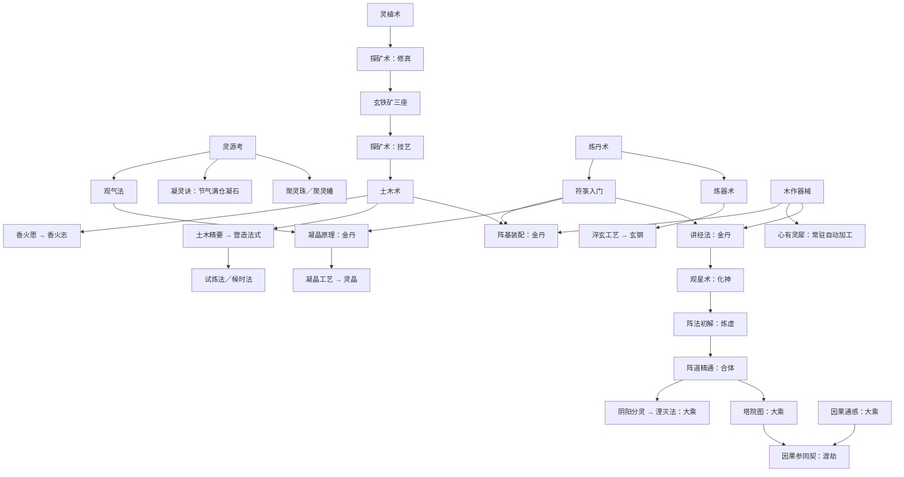

# 当前修真与工艺体系审视（2026-10-09）

以当前工作区 v0.14 数据和引擎为准。这是现状整理与审视记录，不是改版方案；未调整游戏规则或数值。旧设计稿中的草案、旧平衡实测不能直接代表本版。

## 1. 体系分工

| 层 | 当前规模 | 负责什么 | 成长方式 |
| --- | --- | --- | --- |
| 修真 | 39 项 | 建筑方向、系统开关、后续技艺与法宝入口 | 一次性参悟，主要花感悟，也消耗材料 |
| 技艺 | 29 项 | 原料产业增产、加工配方与专业收益、仓储、防灾 | 一次性学习，花感悟与材料 |
| 法宝 | 16 件 | 产业增产、加工收益、仓储、士气、防灾 | 初次炼成后可以反复祭炼 |
| 制作 | 13 个配方 | 原料变加工品，多条产业汇合成高级成品 | 手动瞬时制作；自动按配方节拍连续加工 |
| 境界 | 11 境（含凡体） | 全局产出倍率、研究门槛、自动加工速度与重置入口 | 支付下一境的资源费用，确定性突破 |

合计 84 项修真、技艺与法宝。两页共用感悟、前置判断和已学记录；`needs.upgrades` 可以跨页引用。技艺并非全部属于加工：引气诀、伐木要术、储物袋、口传心授等也在这一层。

主循环是：原料生产 → 研究／学习 → 加工 → 建设与扩仓 → 更多产能／感悟 → 破境 → 新研究。境界本身只检查资源费用，不要求完成某个指定研究；研究和建筑在生产、配方与容量上间接支撑破境。

## 2. 修真五段是分类，不是五个顺序阶段

| 界面分组 | 项数 | 内容 |
| --- | --- | --- |
| Ⅰ 感知 | 4 | 灵源、凝石自动化、聚气、凝晶原理 |
| Ⅱ 识物 | 4 | 草木、矿物、香火 |
| Ⅲ 造物 | 6 | 土木、炼丹、制符、炼器、营造 |
| Ⅳ 制度 | 16 | 讲经、静心、招募、自动化、破境折扣、离线及高级宗门设施 |
| Ⅴ 法则 | 9 | 观星、阵法、因果、分灵与湮灭 |

这些分组没有“上一段完成才能进入下一段”的门槛，前期可以同时开展感知、识物、造物。制度组包含器道精微、符法精微、洞天福地等题材，分类与其含义有一定距离。

## 3. 关键依赖路线

下面的箭头表示主要前置方向；节点的全部条件和费用见后面的完整清单。

木作器械位于技艺层，却直接卡住讲经法、静心诀、心有灵犀等修真；技艺层的探矿术卡住土木术。这是现行的双向依赖，并非两棵独立科技树。

## 4. 工艺升级与加工规则

木作器械开放木板；阵基装配、淬玄工艺、凝晶工艺在金丹开放阵基、玄钢、灵晶。炼丹、制符和基础炼器通过对应建筑开放，仙草通过三座药圃开放；九转丹通过九转丹炉开放，灵符与灵器通过基础专业建筑开放，灵宝通过器道精微开放。

因此高级成品的门槛并不统一：九转丹、灵符、仙草可以在金丹前取得；灵器虽然配方只要求炼器坊，但玄钢原料的常规制造路线从金丹开始；灵宝经器道精微至少要到炼虚。

| 加工设施 | 每座制作收益 | 其他作用／维护 |
| --- | --- | --- |
| 百工坊 | 全部配方 +6% | 木板容量 +300；消耗灵木 0.8/秒 |
| 炼丹房 | 丹药、九转丹 +5% | 灵草普通产出 +10%，丹药容量 +200；灵木 0.25/秒 |
| 炼器坊 | 法器、玄钢、灵器、灵宝 +5% | 玄铁普通产出 +10%，法器容量 +120；灵木 0.5/秒 |
| 符箓堂 | 符箓、灵符 +5% | 符箓容量 +200；灵木 0.2/秒 |

每份理论制作收益 = 配方基础数量 ×（1 + 通用制作加成 + 对应成品专业加成）。加成相加，没有统一上限；小数收益累计成整数。设施停用或维护供给不足会使其收益停止或缩减。

普通资源产出加成 `ratio` 与制作加成 `craftBonusByResource` 分开结算。木板、灵石等经过配方得到的资源，并不会因为普通产出加成而提高每份配方收益。境界也不会直接乘上每份加工收益。

自动加工速度 = max(1, √(当前境界倍率 ÷ 2))；实际间隔 = 配方基础秒数 ÷ 加工速度。金丹仍为 ×1，元婴开始提速，渡劫约 ×4.47。各配方独立运行，没有共享工位总量；常规调度按配方数据顺序，会竞争同一批原料。手动制作瞬时完成，不受配方秒数限制。

自动化入口有三档：

1. 凝灵诀：每个节气（45 秒），灵气满仓时尝试用一半库存凝石；同时开放库存目标。
2. 心有灵犀：开放常驻自动加工及库存目标，需木作器械，学习费用含丹药 10。
3. 首颗道果：永久开放自动加工、库存目标、指定一个优先配方及材料保留比例。

库存目标 0 表示不限，达到目标暂停、消费后补货；配方仍受解锁、材料和仓储约束。离线也推进自动加工。

## 5. 法宝祭炼

法宝炼成后以 0 级基础效果生效；祭炼至 n 级，效果为基础效果 ×（1 + 0.3n）。所有法宝均无等级硬上限。

下一次祭炼的基本材料沿用初次炼成的非感悟费用，乘 1.7^当前等级；感悟另用 `refine.insight`，同样乘 1.7^当前等级。部分法宝从指定当前等级开始追加进阶材料，追加项从该门槛开始按 1.7 倍递增。完整法宝表列出这些门槛。

祭炼主要放大单项产业或防灾、仓储、士气，没有建筑／技艺／法宝提供的永久全局产出加成。境界、仙缘、道果以及临时效果仍构成全局成长来源。

## 6. 境界与重置

境界属于宗门整体等级，没有个人修为、修炼进度条、成功率或渡劫战斗。破境只要资源足够即可成功。

破境心法减费 15%，候时法 10%，心印法 15%；三者相加，共减费 40%，引擎折扣上限为 90%。每名弟子的基础灵气消耗为 0.25 × 境界倍率／秒，再应用减耗；破境同时提高产出与养人成本。

化神可以转世，渡劫可以飞升，不要求先转世或做完全部研究。两者都重置本世资源、人口、建筑、修真、技艺、法宝及祭炼、加工进度、境界；成就与长期统计保留，永久仙缘与道果保留。飞升另得一颗道果。

仙缘结算 = floor(√(本世累计存入的感悟 ÷ 2000) ×（1 + 境界下标 × 0.3）×（1 + 结算加成）×（1 + 道果数 × 0.1）)，可结算时最低 1 点。这里统计累计入库感悟，已花掉的仍计入，满仓截断的部分不计入。

每点仙缘带来 +2% 全局产出与 +0.15% 仓储，分别渐近 +200%／+50%；每颗道果 +5% 全局产出与 +10% 仙缘结算收益。

## 7. 优先审视的地方

以下分清“代码事实”与“设计判断”，不将疑点直接认定为应当修改的缺陷。

| 代码事实 | 对体系的影响／待审视问题 |
| --- | --- |
| 修真是研究与设施解锁，个人修炼机制尚未出现 | 当前修真体验主要来自宗门科技发展。要保留这种定位，还是让每个境界引入修行方式的变化？ |
| 两个页面都有“探矿术”，但 id 与作用不同；修真依赖技艺版探矿术 | 名称相同会掩盖真实路线；“原理→应用”之间应当如何命名和展示？ |
| 五段只分组；制度占 16/39 项，并容纳器道、符法、洞天 | 五段是否继续作为主题分类，还是需要重整为认知递进？ |
| 39 项修真中 26 项直接列出建筑解锁；器道精微、符法精微、大乘心印主要开放后续条目 | 多数成果通过建设兑现。每项研究能否让玩家清楚理解新能力，哪些只是付费通行证？ |
| 候时法写元婴门槛，却要求化神才开的营造法式；大乘心经写合体，却要求大乘才开的大乘心印 | 显式境界不等于实际最早境界；两项实际分别至少为化神、大乘。需要统一显示与设计意图。 |
| 灵纹锯阵、灵火冶炼、百草育灵的代码门槛为化神（下标 6），原版本说明写“炼虚新增” | 本清单按化神记；需确认三条强化线究竟想安排在哪一境。 |
| 九转丹、灵符、仙草主要靠设施／法宝解锁，金丹三工艺则采用境界 + 研究 + 建筑 | 加工层级与境界并未一一对应。是否希望高级成品代表明确阶段，还是允许提前布局？ |
| 境界突破不检查指定研究，转世／飞升也不要求完整科技树 | 科技路线具有可选性；要明确哪些是进度主线、哪些是支线投资，避免把全研究当作通关要求。 |
| 常驻自动加工按配方顺序争抢材料，手动制作不受节拍限制 | 产能、仓储与操作频率会共同决定速度；后续平衡不能只用配方耗时判断瓶颈。 |
| 灵能只写入普通产出的资源倍率，却将木板、灵石列入受益资源；两者主要依靠加工获得 | 分灵→湮灭对木板、凝气成石的配方收益没有直接提升；需要审视其宣称受益与实际作用。 |
| 旧 README 曾记 26 条技艺与低价阵基，已同步；旧工艺稿已标记为 v0.11 历史，保留当时配方与百工坊 15% | 当前为 29 条技艺、阵基 25木板+25符箓+100玄铁、百工坊 6%。本次清单以当前源码为准。 |

审视顺序建议：先确定“修真研究”的定位，再划定每个境界应当开启的能力，之后整理各产业的原理／工艺／精研节点，最后校准材料费用与阶段时长。

## 8. 完整数据清单

下表来自当前 `src/data`。所有前置用“且”连接；“无境界限制”仅表示条目自身未写境界，前置链、所需材料及容量仍可能把它推迟。修真表的后续条目从实际 `needs` 反查，列的是直接关联，可能还需要其他前置。

### 8.1 修真：39 项

#### Ⅰ 感知（4 项）

| 名称（id） | 全部直接前置 | 费用 | 自身效果 | 直接开放／后续关联 |
| --- | --- | --- | --- | --- |
| 灵源考（`qiOrigin`） | 藏经阁 2座 | 感悟 60 | 开放灵脉井 | 建筑：灵脉井；修真：凝灵诀；修真：观气法；法宝：聚灵珠；法宝：聚灵幡 |
| 凝灵诀（`condenseArt`） | 灵源考 | 感悟 120、灵木 150、灵石 20 | 节气满仓自动凝石 | — |
| 观气法（`qiGazing`） | 灵源考 | 感悟 150、灵木 300、灵石 60 | 开放聚灵大阵 | 建筑：聚灵大阵；修真：凝晶原理 |
| 凝晶原理（`crystalTheory`） | 金丹期；观气法；符箓入门 | 感悟 300 | 开放晶核聚灵阵 | 建筑：晶核聚灵阵；技艺：凝晶工艺 |

#### Ⅱ 识物（4 项）

| 名称（id） | 全部直接前置 | 费用 | 自身效果 | 直接开放／后续关联 |
| --- | --- | --- | --- | --- |
| 灵植术（`herbStudy`） | 藏经阁 1座 | 感悟 40、灵木 120 | 开放药圃 | 建筑：药圃；修真：探矿术（修真） |
| 探矿术（修真）（`prospectStudy`） | 灵植术 | 感悟 60、灵木 200 | 开放玄铁矿 | 建筑：玄铁矿；建筑：灵石矿 |
| 香火愿（`incenseVow`） | 土木术 | 感悟 200、灵木 400 | 开放山门 | 建筑：山门；修真：香火志 |
| 香火志（`incenseStudy`） | 金丹期；香火愿 | 感悟 700、灵木 800、香火 200 | 开放香火鼎 | 建筑：香火鼎；修真：山门志 |

#### Ⅲ 造物（6 项）

| 名称（id） | 全部直接前置 | 费用 | 自身效果 | 直接开放／后续关联 |
| --- | --- | --- | --- | --- |
| 土木术（`earthArt`） | 探矿术（技艺） | 感悟 120、灵木 300、玄铁 40 | 开放库房 | 建筑：库房；修真：香火愿；修真：土木精要；技艺：阵基装配 |
| 炼丹术（`alchemyArt`） | 藏经阁 2座 | 感悟 200、灵草 120、灵木 120 | 开放炼丹房 | 建筑：药藏；建筑：炼丹房；修真：符箓入门；修真：炼器术；法宝：九转丹炉；法宝：百草葫芦 |
| 符箓入门（`talismanArt`） | 炼丹术 | 感悟 240、灵木 400、灵草 100 | 开放符箓堂 | 建筑：法藏；建筑：符箓堂；修真：凝晶原理；修真：讲经法；修真：静心诀；修真：符法精微；技艺：阵基装配；法宝：镇岳符 |
| 炼器术（`forgeArt`） | 炼丹术 | 感悟 260、玄铁 120、灵木 200 | 开放炼器坊 | 建筑：法藏；建筑：炼器坊；修真：器道精微；技艺：淬玄工艺；法宝：飞剑；法宝：青木斧；法宝：穿山凿 |
| 土木精要（`earthEssence`） | 元婴期；土木术 | 感悟 800、灵木 1,200、木板 12 | 开放材料库 | 建筑：材料库；修真：营造法式 |
| 营造法式（`buildingCode`） | 化神期；土木精要 | 感悟 2,600、木板 20、玄钢 4 | 开放精舍 | 建筑：精舍；修真：试炼法；修真：候时法 |

#### Ⅳ 制度（16 项）

| 名称（id） | 全部直接前置 | 费用 | 自身效果 | 直接开放／后续关联 |
| --- | --- | --- | --- | --- |
| 讲经法（`preachArt`） | 金丹期；符箓入门；木作器械；藏经阁 3座 | 感悟 320 | 开放讲经堂 | 建筑：讲经堂；修真：观星术；法宝：传音玉简 |
| 静心诀（`calmMind`） | 金丹期；符箓入门；木作器械；药圃 3座 | 感悟 400、灵草 200 | 开放静心池 | 建筑：静心池；修真：灵兽驯养；法宝：静心蒲团 |
| 广开山门（`recruitDrive`） | 山门 3座 | 感悟 500、灵石 300、香火 150 | 到来间隔 −30% | — |
| 心有灵犀（`intuition`） | 木作器械 | 感悟 900、灵石 600、丹药 10 | 常驻自动加工 | — |
| 祖师遗泽（`ancestorArt`） | 炼虚期；香火鼎 2座 | 感悟 1,200、灵石 900、符箓 8 | 开放祖师殿 | 建筑：祖师殿；法宝：聚愿鼎 |
| 破境心法（`breakthroughArt`） | 筑基期 | 感悟 2,000、灵石 1,500、丹药 30 | 破境减费 15% | — |
| 灵兽驯养（`beastTaming`） | 合体期；静心诀 | 感悟 3,200、灵石 2,800、灵草 1,500 | 开放灵兽园 | 建筑：灵兽园；法宝：驭兽铃 |
| 洞天福地（`grottoArt`） | 合体期；材料库 2座 | 感悟 4,000、灵石 3,500、法器 12 | 开放洞天；开放洞府 | 建筑：洞府；建筑：洞天；法宝：纳物戒 |
| 龟息功（`longBreath`） | 元婴期 | 感悟 6,000、灵石 5,000、丹药 40 | 离线上限 +8小时 | 修真：定息法 |
| 试炼法（`trialArt`） | 化神期；营造法式 | 感悟 3,600、丹药 60、灵草 2,000 | 开放试炼塔 | 建筑：试炼塔 |
| 器道精微（`artifactLore`） | 炼虚期；炼器术 | 感悟 6,400、法器 25、玄铁 4,000、木板 20 | 仅开放后续条目 | 法宝：护山阵盘；配方：铸灵宝 |
| 符法精微（`talismanLore`） | 炼虚期；符箓入门 | 感悟 7,600、符箓 120、灵木 6,000 | 仅开放后续条目 | 法宝：镇岳符 |
| 候时法（`hourArt`） | 元婴期；营造法式 | 感悟 1,800、灵石 1,200、符箓 5 | 破境减费 10% | 修真：心印法 |
| 定息法（`breathArt`） | 化神期；龟息功 | 感悟 5,200、丹药 40、木板 20 | 离线上限 +8小时 | — |
| 山门志（`gateRecord`） | 炼虚期；香火志 | 感悟 9,000、香火 4,000、法器 10 | 到来间隔 −30% | — |
| 心印法（`mindSeal`） | 合体期；候时法 | 感悟 15,000、丹药 120、灵草 6,000 | 破境减费 15% | 修真：大乘心印 |

#### Ⅴ 法则（9 项）

| 名称（id） | 全部直接前置 | 费用 | 自身效果 | 直接开放／后续关联 |
| --- | --- | --- | --- | --- |
| 观星术（`astrologyArt`） | 化神期；讲经法 | 感悟 450、符箓 6 | 开放观星台 | 建筑：观星台；修真：阵法初解；法宝：观星盘 |
| 阵法初解（`arrayBasics`） | 炼虚期；观星术；讲经堂 2座 | 感悟 1,500、符箓 12、法器 3 | 开放护山大阵 | 建筑：护山大阵；修真：阵道精通；技艺：护山阵纹；法宝：护山阵盘 |
| 阵道精通（`arrayMastery`） | 合体期；阵法初解；护山大阵 3座 | 感悟 9,000、符箓 25、灵符 4 | 开放锁灵阵 | 建筑：锁灵阵；修真：塔院图；修真：阴阳分灵；技艺：阵纹精研；法宝：镇岳印 |
| 因果通感（`karmaSense`） | 大乘期 | 感悟 50,000、灵石 40,000、丹药 100 | 仙缘结算 +30%；仙缘产出乘区固定 +0.005（不按仙缘点数放大） | 修真：因果参同契 |
| 塔院图（`towerPlan`） | 大乘期；阵道精通 | 感悟 60,000、灵石 80,000、法器 30、木板 60、玄钢 15 | 开放通天塔 | 建筑：通天塔；修真：因果参同契 |
| 因果参同契（`karmaConcord`） | 渡劫期；因果通感；塔院图 | 感悟 200,000、符箓 200、丹药 300、香火 20,000、九转丹 40、灵符 25、灵宝 2 | 开放因果池 | 建筑：因果池 |
| 大乘心印（`greatVehicleSeal`） | 大乘期；心印法 | 感悟 40,000、法器 60、符箓 120、木板 40、灵宝 1 | 仅开放后续条目 | 技艺：大乘心经 |
| 阴阳分灵（`yinyangSplit`） | 大乘期；阵道精通 | 感悟 80,000、灵石 30,000、灵器 6 | 开放阴阳分灵阵 | 建筑：阴阳分灵阵；修真：湮灭法 |
| 湮灭法（`annihilationArt`） | 大乘期；阴阳分灵 | 感悟 60,000、九转丹 20、灵符 20 | 开放湮灭炉 | 建筑：湮灭炉 |

### 8.2 技艺：29 项

| 名称（id） | 全部直接前置 | 费用 | 效果及配方入口 |
| --- | --- | --- | --- |
| 引气诀（`qiArt`） | 藏经阁 1座 | 感悟 6、灵木 120 | 灵气普通产出 +10% |
| 伐木要术（`forestryArt`） | 伐木场 1座 | 感悟 9、灵木 260 | 灵木普通产出 +20% |
| 探矿术（技艺）（`prospectArt`） | 玄铁矿 3座 | 感悟 45、玄铁 120、灵木 300 | 玄铁普通产出 +20% |
| 百草辨（`herbLore`） | 药圃 3座 | 感悟 45、灵草 150、灵木 300 | 灵草普通产出 +20% |
| 阵法精要（`fieldTillage`） | 引气诀；聚灵阵 5座 | 感悟 45、灵石 60、灵木 400 | 灵气普通产出 +10%；阵徒岗位产出 +25% |
| 铁木工艺（`timberCraft`） | 伐木要术；玄铁矿 1座 | 感悟 90、灵木 900、玄铁 120 | 灵木普通产出 +25% |
| 木作器械（`woodworking`） | 伐木场 2座 | 感悟 120、灵木 400、玄铁 80 | 木板制作 +5%；开放刨木成板 |
| 流水作坊（`waterworkshop`） | 木作器械 | 感悟 900、木板 30、玄铁 600 | 木板制作 +8%；阵基制作 +8% |
| 阵基装配（`arrayAssembly`） | 金丹期；土木术；木作器械；符箓入门；符箓堂 1座 | 感悟 180、木板 2、符箓 2、玄铁 40 | 阵基制作 +5%；开放组装阵基 |
| 淬玄工艺（`steelWorking`） | 金丹期；炼器术；炼器坊 1座 | 感悟 180、玄铁 160、法器 2 | 玄钢制作 +5%；开放淬玄成钢 |
| 凝晶工艺（`crystalCraft`） | 金丹期；凝晶原理；符箓堂 1座 | 感悟 200、符箓 6、玄铁 80 | 灵晶制作 +5%；开放凝气结晶 |
| 晶纹精修（`crystalPolishing`） | 元婴期；凝晶工艺 | 感悟 1,200、灵晶 8、符箓 20 | 灵晶制作 +20% |
| 深邃坑道（`deepShaft`） | 探矿术（技艺）；玄铁矿 6座 | 感悟 190、玄铁 700、灵木 300 | 玄铁普通产出 +25% |
| 药圃轮作（`herbRotation`） | 百草辨；药圃 6座 | 感悟 160、灵草 700、灵木 240 | 灵草普通产出 +25% |
| 灵泉灌溉（`spiritIrrigation`） | 阵法精要；灵脉井 1座 | 感悟 270、灵石 500、灵木 1,200 | 灵气普通产出 +15% |
| 储物袋（`storageBag`） | 谷仓 2座 | 感悟 35、灵木 500、灵草 200 | 通用仓储 +400（成品按层级折算） |
| 纳物诀（`voidPouch`） | 储物袋 | 感悟 750、灵石 2,600、灵草 1,200、符箓 4 | 通用仓储 +750（成品按层级折算） |
| 香火愿力（`incensePower`） | 山门 2座 | 感悟 120、香火 200、灵木 800 | 香火普通产出 +30% |
| 祖师香火（`ancestorIncense`） | 香火愿力；香火鼎 2座 | 感悟 480、香火 900、符箓 12、灵木 1,500 | 香火普通产出 +20% |
| 口传心授（`oralTeaching`） | 藏经阁 1座 | 感悟 35、灵木 400 | 感悟普通产出 +10% |
| 星象推演（`starReading`） | 口传心授；讲经堂 1座 | 感悟 110、符箓 8、灵草 300 | 感悟普通产出 +15% |
| 丹火纯青（`alchemyFire`） | 炼丹房 1座 | 感悟 270、灵草 900、丹药 6 | 丹药制作 +5%；九转丹制作 +5% |
| 御剑术（`swordFlight`） | 深邃坑道；炼器坊 3座 | 感悟 780、玄铁 4,000、法器 18、玄钢 6 | 灵木普通产出 +20%；玄铁普通产出 +20%；法器制作 +10%；灵器制作 +10%；灵宝制作 +10% |
| 护山阵纹（`arrayPatterns`） | 阵法初解 | 感悟 540、玄铁 1,800、符箓 8、灵晶 6 | 天灾减损 +5% |
| 阵纹精研（`arrayRefine`） | 阵道精通 | 感悟 3,600、符箓 45、法器 20、灵晶 20 | 灵气普通产出 +60%；阵基制作 +30%；灵晶制作 +30%；灵符制作 +30%；符箓制作 +20% |
| 灵纹锯阵（`spiritSaw`） | 化神期；铁木工艺；流水作坊 | 感悟 4,500、木板 80、玄钢 20、灵晶 15 | 灵木普通产出 +95%；木板制作 +50% |
| 灵火冶炼（`spiritSmelting`） | 化神期；深邃坑道；淬玄工艺；御剑术 | 感悟 4,500、玄钢 25、法器 40、灵晶 15 | 玄铁普通产出 +95%；玄钢制作 +50%；法器制作 +30%；灵器制作 +30% |
| 百草育灵（`spiritCultivation`） | 化神期；药圃轮作；丹火纯青 | 感悟 4,500、丹药 80、仙草 15、灵晶 15 | 灵草普通产出 +95%；丹药制作 +50%；仙草制作 +30% |
| 大乘心经（`mahayanaArt`） | 合体期；大乘心印 | 感悟 9,000、法器 60、符箓 60、丹药 60、香火 6,000 | 感悟普通产出 +120%；香火普通产出 +120%；灵草普通产出 +80%；仙草制作 +50%；九转丹制作 +50%；灵宝制作 +30% |

### 8.3 法宝：16 件

追加材料的“从 n 级起”指本次祭炼前的当前等级；例如从 2 级起，首次追加发生在 2→3 级。基础材料沿用炼成费用的非感悟部分。

| 法宝（id） | 全部直接前置 | 初次炼成费用 | 0级基础效果 | 祭炼基础感悟／追加材料 |
| --- | --- | --- | --- | --- |
| 聚灵珠（`spiritPearl`） | 灵源考 | 感悟 20、灵石 90、灵木 200 | 灵气普通产出 +15% | 感悟 60 |
| 聚灵幡（`spiritBanner`） | 灵源考 | 感悟 45、灵木 600、灵石 200 | 灵气普通产出 +10%；灵草普通产出 +10% | 感悟 150 |
| 九转丹炉（`alchemyCauldron`） | 炼丹术 | 感悟 150、丹药 10、灵草 600、灵石 400 | 丹药制作 +8%；九转丹制作 +8% | 感悟 500；从 2 级起追加 九转丹 1 |
| 百草葫芦（`herbGourd`） | 炼丹术 | 感悟 90、灵草 700、灵石 260 | 灵草普通产出 +30% | 感悟 300；从 0 级起追加 仙草 2 |
| 飞剑（`flyingSword`） | 炼器术 | 感悟 450、法器 14、玄铁 2,000、灵石 1,500 | 灵木普通产出 +40%；玄铁普通产出 +40%；法器制作 +15%；灵器制作 +15% | 感悟 1500；从 2 级起追加 玄钢 2、灵器 1 |
| 青木斧（`greenwoodAxe`） | 炼器术 | 感悟 95、灵木 1,400、灵石 300 | 灵木普通产出 +30% | 感悟 320 |
| 穿山凿（`mountainPick`） | 炼器术 | 感悟 140、玄铁 900、灵石 400 | 玄铁普通产出 +30% | 感悟 480 |
| 镇岳符（`wardTalisman`） | 符箓入门；符法精微 | 感悟 180、符箓 12、灵木 1,000、灵石 500 | 天灾减损 +8% | 感悟 600 |
| 传音玉简（`jadeSlip`） | 讲经法 | 感悟 180、灵石 800、符箓 6 | 感悟普通产出 +15% | 感悟 600 |
| 观星盘（`astrolabe`） | 观星术 | 感悟 330、灵石 1,500、法器 6 | 感悟普通产出 +20% | 感悟 1100 |
| 静心蒲团（`calmMat`） | 静心诀 | 感悟 270、灵草 1,400、灵木 1,200、灵石 800 | 士气 +5 | 感悟 900 |
| 驭兽铃（`beastBell`） | 灵兽驯养 | 感悟 1,200、灵草 5,000、丹药 20、灵石 4,000 | 采药人岗位产出 +30%；矿工岗位产出 +30% | 感悟 4000 |
| 护山阵盘（`mountainPlate`） | 阵法初解；器道精微 | 感悟 660、玄铁 2,500、符箓 10、灵石 2,200 | 天灾减损 +5% | 感悟 2200；从 1 级起追加 阵基 2、灵符 1 |
| 聚愿鼎（`vowCauldron`） | 祖师遗泽 | 感悟 720、香火 2,000、符箓 12、灵石 2,000 | 香火普通产出 +40% | 感悟 2400 |
| 纳物戒（`voidRing`） | 洞天福地 | 感悟 1,800、灵石 7,000、法器 25、灵木 4,000 | 通用仓储 +500（成品按层级折算） | 感悟 6000；从 2 级起追加 灵宝 1 |
| 镇岳印（`zhenyueSeal`） | 阵道精通 | 感悟 3,600、符箓 50、法器 35、玄铁 8,000、灵石 11,000 | 灵气普通产出 +80%；玄铁普通产出 +60%；灵石普通产出 +60%；阵基制作 +40%；灵符制作 +40% | 感悟 12000 |

### 8.4 配方：13 项

以下为一份配方的基础投入与产出；实际收益受制作加成影响。秒数只限制自动加工。

| 配方 | 基础投入 → 基础产出 | 基础秒数 | 全部直接前置 |
| --- | --- | --- | --- |
| 凝气成石（`condenseStone`） | 灵气 45 → 灵石 1 | 0.5 | 初始开放 |
| 采药制丹（`refinePill`） | 灵草 100、灵气 60 → 丹药 1 | 2 | 炼丹房 1座 |
| 刨木成板（`sawPlank`） | 灵木 175 → 木板 1 | 1.5 | 木作器械 |
| 朱砂符箓（`drawTalisman`） | 灵木 125、灵气 60 → 符箓 1 | 2 | 符箓堂 1座 |
| 淬炼法器（`forgeArtifact`） | 玄铁 125、灵石 12 → 法器 1 | 3 | 炼器坊 1座 |
| 组装阵基（`assembleArrayBase`） | 木板 25、符箓 25、玄铁 100 → 阵基 1 | 4 | 金丹期；阵基装配；符箓堂 1座 |
| 淬玄成钢（`refineSteel`） | 玄铁 100、灵气 120 → 玄钢 1 | 4 | 淬玄工艺；炼器坊 1座 |
| 凝气结晶（`condenseCrystal`） | 灵气 500、符箓 10 → 灵晶 1 | 5 | 金丹期；凝晶工艺；符箓堂 1座 |
| 培育仙草（`growImmortalHerb`） | 灵草 100、灵气 200 → 仙草 1 | 5 | 药圃 3座 |
| 九转炼丹（`refineNineTurnPill`） | 丹药 100、仙草 5、灵气 500 → 九转丹 1 | 6 | 九转丹炉 |
| 描灵符（`drawSpiritTalisman`） | 符箓 100、香火 500 → 灵符 1 | 5 | 符箓堂 1座 |
| 铸灵器（`forgeSpiritArtifact`） | 法器 100、玄钢 25 → 灵器 1 | 8 | 炼器坊 1座 |
| 铸灵宝（`forgeSpiritTreasure`） | 灵器 25、九转丹 25、灵符 50 → 灵宝 1 | 12 | 器道精微 |

### 8.5 境界：11 境

费用为突破进入该境界的基础费用，尚未应用破境折扣。倍率为该境界当前总倍率，不是再乘一次前一境倍率。

| 下标／境界 | 全局产出倍率 | 自动加工速度 | 破境基础费用 |
| --- | --- | --- | --- |
| 0／凡体 | ×1 | ×1.00 | — |
| 1／引气入体 | ×1.15 | ×1.00 | 感悟 50、灵石 12 |
| 2／炼气期 | ×1.35 | ×1.00 | 感悟 180、灵石 48、灵草 60 |
| 3／筑基期 | ×1.6 | ×1.00 | 感悟 500、灵石 180、丹药 5 |
| 4／金丹期 | ×2 | ×1.00 | 感悟 1,500、灵石 540、丹药 18、法器 2 |
| 5／元婴期 | ×3 | ×1.22 | 感悟 4,000、灵石 1,500、丹药 45、法器 8、符箓 20 |
| 6／化神期 | ×5 | ×1.58 | 感悟 8,000、灵石 3,600、丹药 90、法器 20、符箓 50 |
| 7／炼虚期 | ×8 | ×2.00 | 感悟 12,000、灵石 8,400、丹药 160、法器 40、符箓 90 |
| 8／合体期 | ×14 | ×2.65 | 感悟 30,000、灵石 21,000、丹药 260、法器 70、符箓 150、香火 3,000 |
| 9／大乘期 | ×24 | ×3.46 | 感悟 80,000、灵石 54,000、丹药 400、法器 110、符箓 240、香火 9,000、玄钢 10、灵符 10 |
| 10／渡劫期 | ×40 | ×4.47 | 感悟 200,000、灵石 150,000、丹药 600、法器 180、符箓 400、香火 25,000、玄钢 30、九转丹 30、灵器 20 |

## 9. 对照源码

- [修真条目与分组](../src/data/upgrades.js)
- [技艺与法宝](../src/data/techniques.js)
- [制作配方](../src/data/crafts.js)
- [建筑](../src/data/buildings.js)
- [境界](../src/data/realms.js)
- [全局参数](../src/data/config.js)
- [门槛、产出、制作与祭炼引擎](../src/game/engine.js)

本次仅核对数据、依赖和计算规则，没有重跑平衡模拟。历史时间实测应与其当时版本一起阅读，不能视为本版阶段时长。
